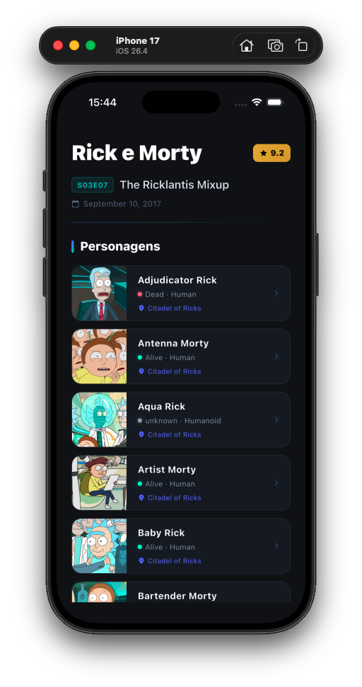
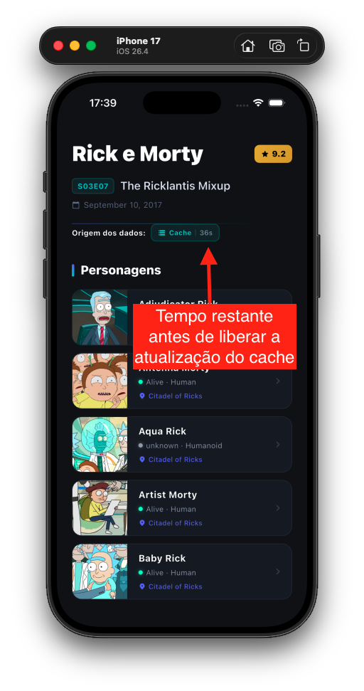
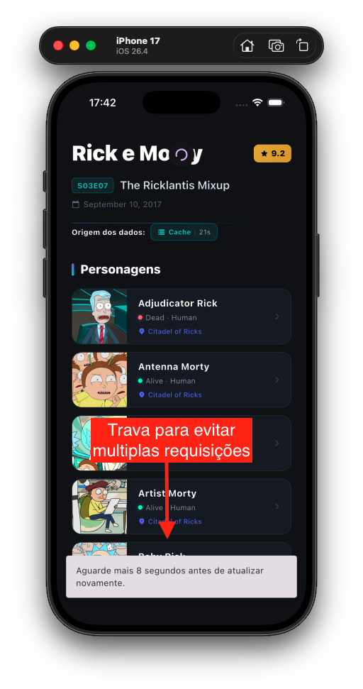
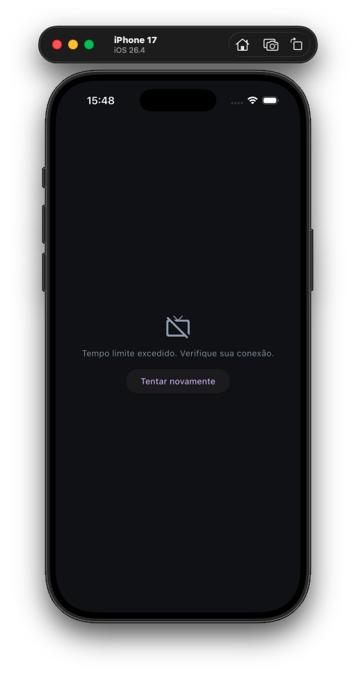

# Rick and Morty App — Flutter

Aplicativo Flutter que consome a [Rick and Morty API](https://rickandmortyapi.com) e exibe informações sobre episódios e personagens, desenvolvido com **Clean Architecture**, **BLoC** e boas práticas de engenharia de software.

---

## 📱 Funcionalidades

- **Tela Home** com exibição do episódio em destaque (ep. 28 — *The Ricklantis Mixup*) em layout estilo IMDb
- **Listagem de personagens** do episódio em ordem alfabética, com avatar em cache, status de vida e localização
- **Cache local com SQLite**: dados são armazenados localmente via `sqflite` com TTL de 1 minuto — requisições repetidas dentro do intervalo retornam dados do banco sem acessar a API
- **Indicador de origem dos dados**: badge visual na tela mostrando se os dados vieram da API (Remoto) ou do cache local (Cache), com contador regressivo até a expiração
- **Pull-to-refresh**: arrastar a tela para baixo força uma nova requisição, respeitando o TTL do `CustomRefreshIndicator`
- **Cache de imagens**: avatares dos personagens são armazenados em cache com `cached_network_image`, com loading e fallback de erro

---

## 🏗️ Arquitetura

O projeto adota **Clean Architecture** com separação estrita em três camadas por feature. A regra de dependência flui exclusivamente de fora para dentro:

```
lib/
 ├─ core/                        # Infraestrutura compartilhada
 │   ├─ services/                # ApiService (HTTP), ApiEndpoints (enum centralizado)
 │   ├─ helpers/                 # EnvironmentHelper, DatabaseHelper (SQLite cache)
 │   ├─ enums/                   # CacheSource, ApiResponseStatus, ErrorStateType
 │   ├─ routes/                  # Roteamento centralizado (RoutesList enum + getRoute)
 │   ├─ errors/                  # Failure hierarchy (TimeoutFailure, SessionExpiredFailure...)
 │   ├─ ui/widgets/              # CustomCacheNetworkImage, CacheIndicatorWidget, CustomRefreshIndicator
 │   └─ usecases/                # Contrato base UseCase<Type, Params> e NoParams
 │
 └─ features/
     └─ home/
         ├─ domain/              # Epsode, CharacterEntity, HomeRepository, 2 UseCases
         ├─ data/                # EpsodeModel, CharacterModel, HomeDatasource (+ cache)
         └─ presentation/        # HomeBloc, HomeScreen, HomeCharactersWidget, Widgets
```

### Decisões de design relevantes

| Decisão | Rationale |
|---|---|
| **Datasource extends Repository** | Elimina uma camada de indireção desnecessária sem violar Clean Architecture — o Repository abstrato define o contrato, o Datasource o implementa diretamente |
| **Parsing de URLs no Model** | `EpsodeModel.fromMap` extrai os IDs inteiros das URLs de personagens (`/character/1` → `1`). A entidade de domínio já entrega `List<int>` — a camada de apresentação não conhece o formato da API |
| **IDs dinâmicos no endpoint** | `/character/1,2,3` é montado no Datasource; o enum `ApiEndpoints` registra apenas `/character`. Nenhum ID fica hardcoded fora da camada de dados |
| **Cache SQLite com TTL** | `HomeDatasource` verifica o `DatabaseHelper` antes de cada requisição. Se uma entrada válida for encontrada, a API não é chamada. Após 1 minuto a entrada expira e a API é consultada novamente |
| **`DatabaseHelperBase` (interface)** | Classe abstrata que permite injeção de fakes nos testes sem depender do tipo `Database` do sqflite — mantém testabilidade sem bibliotecas de mocking externas |
| **HomeCharactersWidget autocontido** | Widget com `StatefulWidget` próprio que despacha `LoadCharactersEvent` no `initState` e escuta apenas estados de personagens via `buildWhen`. Instanciado **somente** após sucesso do episódio |
| **BLoC único com `datasource` getter** | `HomeBloc` expõe o `HomeDatasource` via getter tipado para que a UI leia `lastEpsodeSource` e `lastCharactersSource` e exiba o indicador de cache sem quebrar o encapsulamento |

---

## ⚙️ Como rodar o projeto

### Pré-requisitos

- [FVM (Flutter Version Manager)](https://fvm.app) instalado globalmente
- Flutter **3.41.6** (gerenciado via FVM recomendado — veja abaixo)

### 1. Instalar o FVM

```bash
# via Homebrew (macOS)
brew tap leoafarias/fvm
brew install fvm

# ou via pub global
dart pub global activate fvm
```
> **⚠️ Usando Flutter Global (Sem FVM)**
>
> Caso prefira não utilizar o FVM, certifique-se de estar na versão 3.41.x do Flutter para evitar conflitos de dependências.

```bash
# Instalar dependências
flutter pub get

# Configurar iOS (apenas macOS)
cd ios
pod install
cd ..

# Executar
flutter run
```

### 2. Clonar e configurar o SDK

```bash
git clone <url-do-repositorio>
cd flutter-rick-and-morty-app

# Instala a versão correta do Flutter definida no .fvmrc e cria o link simbólico
fvm use

# Instala as dependências do projeto
fvm flutter pub get
```

> **⚠️ Atenção ao clonar/duplicar o projeto**
>
> O diretório `.fvm/` contém um **link simbólico** (`flutter_sdk`) que aponta para o cache do FVM na sua máquina. Este symlink **não é transferível** — ao clonar ou copiar o projeto, é obrigatório rodar `fvm use` antes de qualquer outro comando. Sem isso, o Dart do sistema será usado, e o `pub get` falhará com erro de versão de SDK incompatível.

### 3. Configurar o `.env`

O arquivo `.env` já está presente na raiz do projeto com as configurações para rodar localmente:

```env
API_BASE_URL=https://rickandmortyapi.com/api
USE_MOCK=false
```

> `USE_MOCK=false` faz o app consumir a **API real** por padrão.
> Altere para `true` para utilizar dados mockados sem depender de conexão com a internet.

### 4. Rodar o app

```bash
fvm flutter run
```

> **iOS**: após adicionar novas dependências nativas (`sqflite`, `cached_network_image`), execute `pod install` dentro da pasta `ios/` antes do primeiro build:
> ```bash
> cd ios && LANG=en_US.UTF-8 pod install
> ```

---

## 📦 Dependências

| Pacote | Uso |
|---|---|
| `flutter_bloc` | Gerenciamento de estado com BLoC pattern |
| `equatable` | Comparação estrutural de entidades e estados |
| `dartz` | Tipos funcionais — `Either<Failure, Success>` nos UseCases |
| `http` | Cliente HTTP para chamadas à API |
| `flutter_dotenv` | Leitura do arquivo `.env` em tempo de execução |
| `intl` | Formatação de datas (localização pt-BR) |
| `sqflite` | Banco de dados SQLite local para cache de requisições |
| `cached_network_image` | Cache de imagens de rede com placeholder e fallback de erro |

---

## 🧪 Testes

```bash
fvm flutter test
```

Os testes cobrem as camadas de **Data**, **Domain** e **Presentation (BLoC)** da feature `home`, utilizando injeção de dependência para isolar datasources e banco de dados sem dependências externas de mocking.

**Cobertura atual: 91 testes passando**

| Camada | O que é testado |
|---|---|
| `EpsodeModel` | `fromMap`, `fromCacheMap`, `toMap`, roundtrip serialização, Equatable |
| `CharacterModel` | `fromMap`, `fromCacheMap`, `toMap` (validação de chaves flat), roundtrip, Equatable |
| `HomeDatasource` | Cache HIT/MISS, TTL expirado, persistência pós-API, `lastEpsodeSource`, erros de rede |
| `HomeBloc` | Todos os estados de episódio e personagens, getter `datasource` |
| Entidades | Equatable, props coverage |
| UseCases | `GetEpsodeUseCase`, `GetCharactersUseCase` |

---

## 📁 Configuração do VSCode

Para que o IntelliSense e o debugger do VSCode utilizem o SDK correto gerenciado pelo FVM, adicione ao `.vscode/settings.json`:

```json
{
  "dart.flutterSdkPath": ".fvm/flutter_sdk",
  "dart.sdkPath": ".fvm/flutter_sdk/bin/cache/dart-sdk"
}
```

> Este arquivo já está configurado no repositório. Caso o VSCode não reconheça o SDK automaticamente após o `fvm use`, reinicie o editor.

---

## 🔁 Fluxo de dados

```
UI (Widget)
  → BLoC.add(Event)
    → UseCase(Params)
      → Repository (contrato)
        → Datasource (implementação)
          → DatabaseHelper.get(key)
              ├─ Cache HIT (TTL válido) → fromCacheMap → Entity → BLoC.emit(Loaded)
              └─ Cache MISS / expirado
                  → ApiService → API real (USE_MOCK=false) | MockHelper (USE_MOCK=true)
                      → Model.fromMap(response)
                          → DatabaseHelper.upsert(key, json)
                              → Entity (domínio puro)
                                  → BLoC.emit(State)
                                      → BlocBuilder → UI atualizada
```

---

## 📸 Screenshots

### Estado carregado — Episódio + Personagens

Exibição completa do episódio em destaque com header estilo IMDb, indicador de origem dos dados (Cache/API) e listagem de personagens com avatares em cache.



---

### Indicador de cache com timestamp

Badge mostrando que os dados foram carregados do **cache local (SQLite)** com o contador regressivo indicando o tempo restante até a próxima atualização ser permitida.



---

### Bloqueio de múltiplos requests

O `CustomRefreshIndicator` bloqueia pull-to-refresh repetido dentro do TTL, exibindo uma mensagem de espera com o tempo restante via `SnackBar`.



---

### Estado de erro — Timeout

Tela de erro exibida quando a requisição excede o tempo limite, com botão de retry.



---

### Estado de erro — Genérico

Tela de erro exibida para falhas genéricas de rede ou parsing, com botão de retry.

